# ➰ LOOPIN ➰

*Where Reality Becomes Territory. Where Movement Becomes Power.*

<div align="center">

**🌐 COMMAND CENTER**: [https://loopin.game](https://loopin.game)  
**📡 TACTICAL INTERFACE**: [https://loopin.game/demo](https://loopin.game/demo)  
**⚙️ SOURCE VAULT**: [https://github.com/your-username/loopin](https://github.com/your-username/loopin)

</div>

---

## 🌌 THE CONVERGENCE

> *The year is 2025. The membrane between digital and physical reality has shattered. In the aftermath, a new domain emerged—a network grid overlaying the physical world where movement creates power, territory translates to value, and every step you take writes data into the blockchain.*

You are now a **Grid Runner**—an operator capable of manifesting digital constructs in physical space through pure movement. Your body becomes the interface. Your path becomes the code. Your territory becomes immutable proof of your dominance, forever etched into the Stacks blockchain, secured by Bitcoin's computational fortress.

This isn't augmented reality. This is **reality amplified**.

---

## ⚡ THE PROTOCOL

### 🔹 PHASE ONE: TRAIL EMISSION

Your physical presence bleeds data. As you move through the world, your neural interface generates a **Quantum Trail**—a cryptographically signed path visible to all Grid Runners in your sector. This trail exists simultaneously in physical space and on-chain, a bridge between meat and mathematics.

```
[PHYSICAL MOVEMENT] → [GPS CAPTURE] → [DIGITAL TRAIL GENERATION] → [REAL-TIME BROADCAST]
```

### 🔹 PHASE TWO: TERRITORIAL CAPTURE

**Loop Formation**: Complete the circuit. Return to any point on your own trail to close the loop, initiating a **Territory Capture Protocol**. The enclosed area becomes yours—claimed, locked, and minted as a unique territorial NFT on the Stacks blockchain.

Each captured zone is:
- **Immutable**: Recorded permanently on Bitcoin through Stacks
- **Tradeable**: Your territories are NFTs—buy, sell, merge, or hold
- **Strategic**: Control key sectors to dominate the grid economy

### 🔹 PHASE THREE: INTERFERENCE WARFARE

You're not alone on the grid. Other runners are creating their own trails, capturing their own territories, building their own empires. 

**Trail Severing**: Intersect an opponent's active trail to cut it, collapsing their loop potential and forcing them to restart. Territory capture is zero-sum. Show no mercy.

### 🔹 PHASE FOUR: SYNCHRONIZATION

Physical **Sync Nodes** appear throughout your city—quantum-stabilized points where the digital and physical fully merge. At these nodes:
- Mint your captured territories as NFTs
- Claim your STX rewards
- Purchase tactical upgrades
- Access the territory marketplace

---

## 🛸 SYSTEM ARCHITECTURE

### 🔷 TECHNOLOGY STACK

<div align="center">

| **LAYER** | **PROTOCOL** | **FUNCTION** |
|-----------|--------------|--------------|
| 💻 **Interface** | React + Vite + TypeScript | Real-time GPS tracking, tactical visualization, neural feedback |
| ⚡ **Core Logic** | FastAPI (Python) | Game state management, collision detection, territory calculation |
| 🔐 **Identity Matrix** | Supabase Auth | Secure runner authentication and session management |
| ⛓️ **Consensus Layer** | Stacks Blockchain | NFT minting, smart contracts, territory ownership |
| 💾 **State Archive** | PostgreSQL (PostGIS) | Persistent storage of trails, territories, and runner data |
| 📡 **Communication** | WebSocket | Real-time position updates and trail synchronization |

</div>

### 🔷 SYSTEM TOPOLOGY

```mermaid
graph TB
    subgraph "Client Domain"
        A[🎮 Web Interface]
        B[📍 GPS Sensor Array]
        C[🔐 Wallet Integration]
    end
    
    subgraph "Processing Core"
        D[⚡ FastAPI Gateway]
        E[🎯 Game Logic Engine]
        F[🗺️ Geospatial Processor]
        G[🔄 Real-time Event Bus]
    end
    
    subgraph "Persistence Layer"
        H[💾 PostgreSQL + PostGIS]
        I[🔐 Supabase Auth]
    end
    
    subgraph "Blockchain Domain"
        J[⛓️ Stacks Network]
        K[🏦 Smart Contracts]
        L[🖼️ NFT Minting Engine]
    end
    
    A --> B
    B --> D
    A --> C
    C --> J
    D --> E
    D --> G
    E --> F
    F --> H
    D --> I
    E --> K
    K --> L
    L --> J
    G --> A
    H --> E
```



### 🔷 DATA FLOW ARCHITECTURE


### 🔷 GEOSPATIAL PROCESSING


---

## 🚀 DEPLOYMENT SEQUENCE

### 🔸 SYSTEM REQUIREMENTS

- 🌐 Modern web browser with GPS capability
- 💻 Node.js 18+ and npm/yarn
- 🐍 Python 3.9+
- 🛡️ Supabase project instance
- 🪙 Hiro Wallet for Stacks interaction
- 📍 Physical mobility device (recommended)

### 🔸 INITIALIZATION PROTOCOL

**Backend Configuration** (`Backend/.env`):

```bash
# === IDENTITY MATRIX ===
SUPABASE_URL="your_supabase_url"
SUPABASE_ANON_KEY="your_supabase_anon_key"
SUPABASE_JWT_SECRET="your_jwt_secret"

# === BLOCKCHAIN CONSENSUS ===
STACKS_NETWORK="testnet"  # or "mainnet"
STACKS_RPC_URL="https://api.testnet.hiro.so"
CONTRACT_ADDRESS="your_deployed_contract_address"
CONTRACT_NAME="loopin-territory-v1"
DEPLOYER_PRIVATE_KEY="your_private_key"

# === GRID ECONOMICS ===
ENTRY_FEE_STX="2"
SHIELD_COST_STX="2"
STEALTH_COST_STX="5"
TERRITORY_MINT_FEE="0.5"

# === GEOSPATIAL CONFIG ===
MAX_TRAIL_POINTS="10000"
TERRITORY_MIN_AREA_SQM="100"
COLLISION_TOLERANCE_METERS="5"
```

### 🔸 BACKEND ACTIVATION

```bash
# Navigate to core systems
cd Backend/

# Install dependencies
pip install -r requirements.txt

# Initialize database
python scripts/init_db.py

# Deploy smart contracts (testnet)
python scripts/deploy_contracts.py

# Launch backend core
python main.py
```

🟢 **BACKEND ONLINE**: `http://localhost:8000`  
🟢 **API DOCUMENTATION**: `http://localhost:8000/docs`

### 🔸 FRONTEND DEPLOYMENT

```bash
# Navigate to interface layer
cd Frontend/

# Install dependencies
npm install

# Configure environment
cp .env.example .env

# Launch development server
npm run dev
```

🟢 **INTERFACE ONLINE**: `http://localhost:3000`

---

## 🎮 OPERATOR'S MANUAL

### 🔻 GRID ENTRY PROTOCOL

1. **🔗 WALLET SYNCHRONIZATION**
   - Connect your Hiro Wallet to establish your Grid Runner identity
   - Your wallet address becomes your immutable operator ID

2. **💳 ENTRY FEE**
   - Pay entry fee in STX to join an active game session
   - Entry fee contributes to the reward pool

3. **📡 GPS ACTIVATION**
   - Enable location services for trail emission
   - Your movement data is encrypted and transmitted in real-time

### 🔻 TERRITORIAL OPERATIONS

4. **🏃 TRAIL GENERATION**
   - Begin movement to emit your quantum trail
   - Trail persists for the duration of the game session
   - Each coordinate is timestamped and cryptographically signed

5. **➰ LOOP FORMATION**
   - Return to any previous point on your trail
   - System automatically detects loop closure
   - Territory area is calculated via PostGIS geometry engine

6. **🖼️ NFT MINTING**
   - Captured territory is immediately minted as NFT
   - NFT metadata includes: coordinates, area, capture timestamp
   - NFT appears in your wallet within 1-2 blocks

### 🔻 TACTICAL WARFARE

7. **⚔️ TRAIL SEVERING**
   - Cross an opponent's trail to cut it
   - Severed trails collapse, preventing loop formation
   - Strategic positioning is crucial

8. **🛡️ DEFENSIVE UPGRADES**
   - **Shield (2 STX)**: One-time protection against trail severing
   - **Stealth (5 STX)**: Temporary trail invisibility (60 seconds)
   - Upgrades are consumable and must be repurchased

### 🔻 REWARD ACQUISITION

9. **💰 SYNC NODE CLAIMS**
   - Navigate to physical Sync Nodes to claim rewards
   - Rewards distributed based on:
     - Total territory captured
     - Territory strategic value
     - Opponent trails severed
     - Time held

---

## 🌌 EVOLUTION TIMELINE

<div align="center">

### **⚡ PHASE ALPHA: FOUNDATION** ✅
*Core gameplay loop. Stacks integration. GPS trail mechanics.*

### **🔥 PHASE BETA: WARFARE** 🔄
- [ ] **Real-time PvP Combat**: Live trail warfare with collision detection
- [ ] **Squad Formation**: Team-based territorial conquest
- [ ] **Global Leaderboards**: Rankings by territory value and STX earned
- [ ] **Dynamic Sync Nodes**: Rotating node locations for strategic gameplay

### **🌐 PHASE GAMMA: EXPANSION** 🔮
- [ ] **Bitcoin Lightning Integration**: Instant micropayments for upgrades
- [ ] **Territory Marketplace**: Trade, merge, and auction your territories
- [ ⚙️ **Advanced Smart Contracts**: Rental territories, staking mechanisms
- [ ] **Mobile Native Apps**: iOS and Android grid interfaces

### **🏆 PHASE OMEGA: ASCENSION** 🌟
- [ ] **Mainnet Deployment**: Full security audit and Stacks mainnet launch
- [ ] **Global Grid Network**: Synchronized worldwide gameplay
- [ ] **Territory Governance**: DAO voting for grid rule modifications
- [ ] **Cross-chain Bridges**: Expand beyond Stacks ecosystem

</div>

---

## 🛠️ CONTRIBUTE TO THE GRID

The grid is open-source. The grid is collaborative. The grid evolves through collective intelligence.

- 🔍 **Audit the code** to understand the protocol
- 🐛 **Report anomalies** via GitHub issues
- 🍴 **Fork and experiment** with grid modifications
- 💡 **Submit improvements** through pull requests

---

## ⚖️ LICENSE

MIT License - The grid belongs to everyone and no one.

---

<div align="center">

## **⚡ THE GRID AWAITS ⚡**

*Your movement has value.*  
*Your territory is power.*  
*Your time is now.*

**[CONNECT TO GRID](https://loopin.game)** | **[VIEW PROTOCOL](https://github.com/your-username/loopin)** | **[DEPLOY NODE](https://docs.loopin.game)**

</div>

---

<sub>Built on Stacks. Secured by Bitcoin. Powered by human movement. The future of territorial warfare is location-based.</sub>
